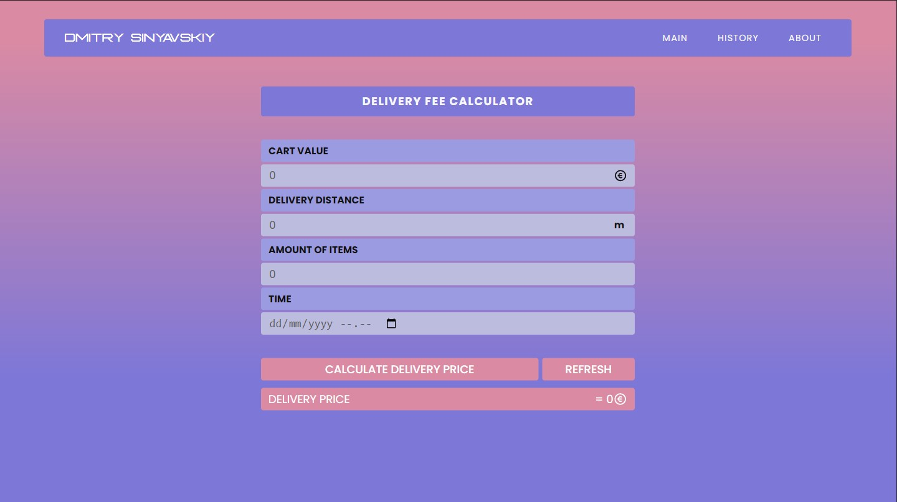
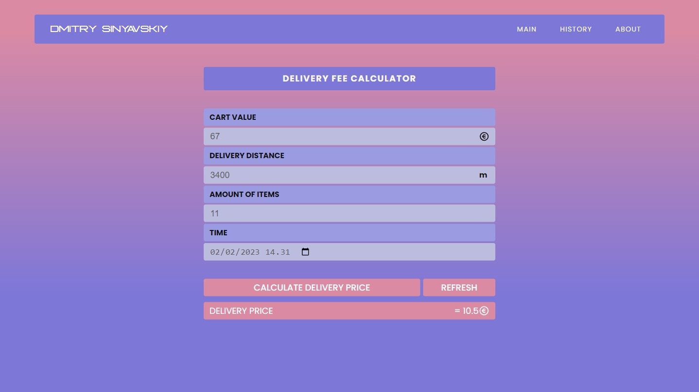
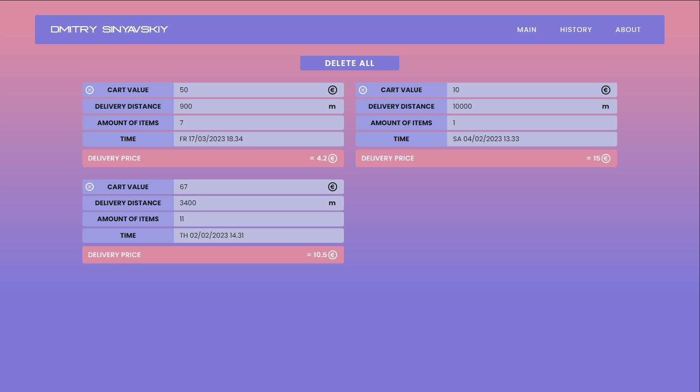
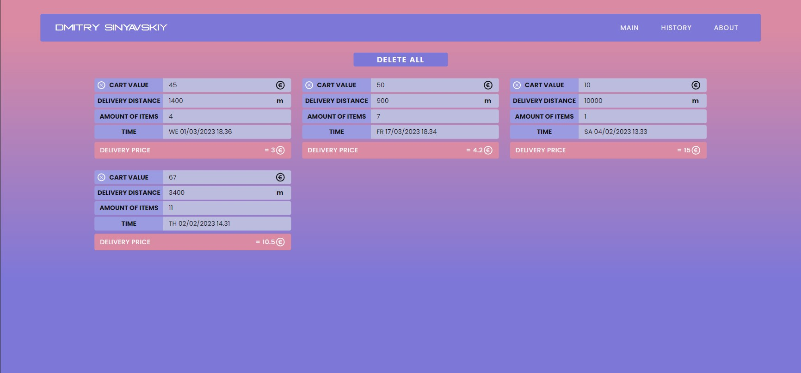
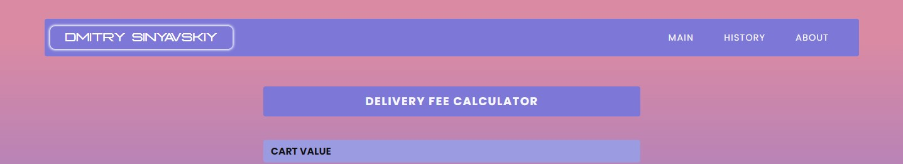
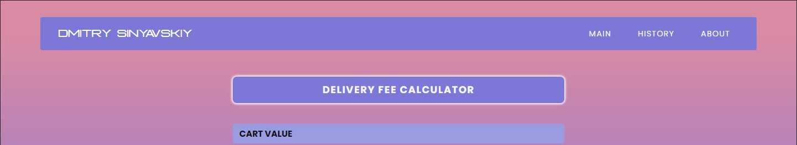
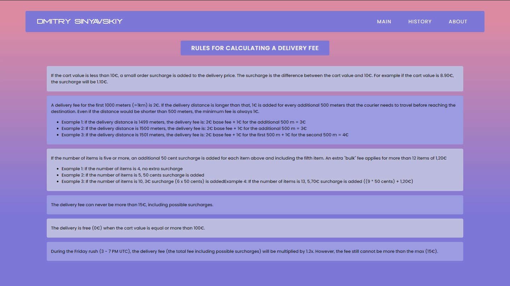
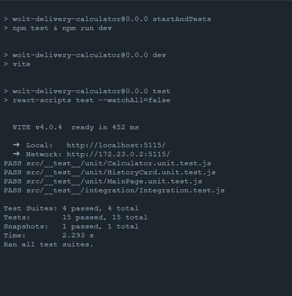
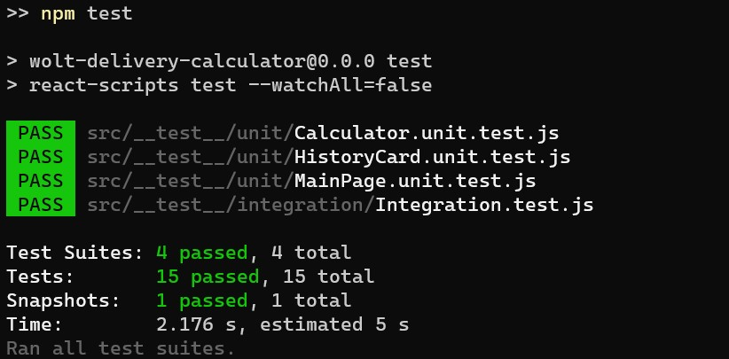

# Job Interview Assignment - Delivery Calculator

## Built with

<!-- ICONS found at: ht<rtps://github.com/devicons/devicon/tree/master/icons -->
<div> 
      &nbsp;
      &nbsp;
      &nbsp;
      &nbsp;
      &nbsp;
</div>

- React application is written in Typescript
- The user interface is divided into pages that are routed through react-router-dom.
- Tests are implemented with JavaScript language
- CSS is used for styling
- The application can be used/run with Docker Image or Container

## Installation

### Docker

1. Download and install `Docker` app from official website

```sh
https://docs.docker.com/get-docker/
```

2. Clone project or download the zip from git (unzip if needed)

3. Run this command in a terminal, in the root folder where the file `docker-compose.yml` is located

```sh
docker-compose up -d
```

4. When all packages are downloaded and installed, the application will run on the port:

   - http://localhost:5115

### NPM

1. You can also run the application manually via `npm`

   Run this command in the terminal to be sure that you have an `npm` installed on your device

```sh
npm -v
```

2. Now you need to install `npm` packages for the project

```sh
npm install
```

3. When all is done you can run the application in development mode by running this command

```sh
npm run dev
```

4. Application will run on the ports:

   - http://localhost:5115

5. Or you can build the application and run it with the following command

```sh
npm run build
```

```sh
npm run preview
```

4. Application will run on the ports:

   - http://localhost:4173

## Functionalities and Usage



- Enter the cart value, delivery distance, amount of items and delivery time

- Click `Calculate delivery price` to make calculations



- All calculations are stored in the browser's `local storage`, and shows on `history page`




- If you want to delete one of the previous calculations, press the cross button on the left top side of it

- If you want to delete all of the calculations, press the `delete all` button



- By pressing on `Dmitry Sinyavskiy`, it will open a new page with my LinkedIn account



- By pressing on `Delevery Fee Calculator`, you will be redirected to the `about` page



- Here you can found all calculation rules

## Testing

- When you run an application via `Docker`, every time at container load or start-up tests will run automatically



- If you want to run the tests manually, in the root folder where the file `package.json` is located, run this command in a terminal

```sh
npm test
```


